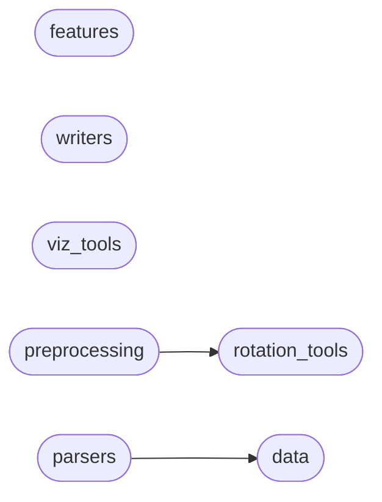

# Code Overview

[_Documentation generated by Documatic_](https://www.documatic.com)

<!---Documatic-section-Codebase Structure Python-start--->
## Codebase Structure Python

The codebase has a flat structure, with 8 code files.

<!---Documatic-block-system_architecture-start--->

<!---Documatic-block-system_architecture-end--->

# #
<!---Documatic-section-Codebase Structure Python-end--->

<!---Documatic-section-File IO-start--->
## File IO

<!---Documatic-block-file_io-start--->
The following files have file read operations

<!---Documatic-block-pymo-start--->

	
<code>pymo</code> (Click to Expand!)

* pymo.parsers

<!---Documatic-block-pymo-end--->

The following files have file write operations

<!---Documatic-block-pymo-start--->

	
<code>pymo</code> (Click to Expand!)

* pymo.viz_tools: test.bvh, test.csv

<!---Documatic-block-pymo-end--->
<!---Documatic-block-file_io-end--->

# #
<!---Documatic-section-File IO-end--->

<!---Documatic-section-Class Hierarchy-start--->
## Class Hierarchy

<!---Documatic-block-BaseEstimator-start--->

	
<code>BaseEstimator</code> (Click to Expand!)

* pymo.preprocessing.ConstantsRemover
* pymo.preprocessing.DownSampler
* pymo.preprocessing.Flattener
* pymo.preprocessing.JointSelector
* pymo.preprocessing.ListStandardScaler
* pymo.preprocessing.MocapParameterizer
* pymo.preprocessing.Numpyfier
* pymo.preprocessing.RootCentricPositionNormalizer
* pymo.preprocessing.RootTransformer
* pymo.preprocessing.TemplateTransform

<!---Documatic-block-BaseEstimator-end--->

<!---Documatic-block-TransformerMixin-start--->

	
<code>TransformerMixin</code> (Click to Expand!)

* pymo.preprocessing.ConstantsRemover
* pymo.preprocessing.DownSampler
* pymo.preprocessing.Flattener
* pymo.preprocessing.JointSelector
* pymo.preprocessing.ListStandardScaler
* pymo.preprocessing.MocapParameterizer
* pymo.preprocessing.Numpyfier
* pymo.preprocessing.RootCentricPositionNormalizer
* pymo.preprocessing.RootTransformer
* pymo.preprocessing.TemplateTransform

<!---Documatic-block-TransformerMixin-end--->

# #
<!---Documatic-section-Class Hierarchy-end--->

[_Documentation generated by Documatic_](https://www.documatic.com)